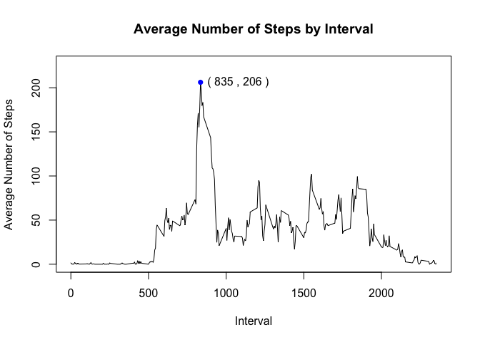

# Reproducible Research: Peer Assessment 1
### 1. Introduction
It is now possible to collect a large amount of data about personal movement using activity monitoring devices such as a Fitbit, Nike Fuelband, or Jawbone Up. These type of devices are part of the "quantified self" movement -- a group of enthusiasts who take measurements about themselves regularly to improve their health, to find patterns in their behavior, or because they are tech geeks. But these data remain under-utilized both because the raw data are hard to obtain and there is a lack of statistical methods and software for processing and interpreting the data.

This assignment makes use of data from a personal activity monitoring device. This device collects data at 5 minute intervals through out the day. The data consists of two months of data from an anonymous individual collected during the months of October and November, 2012 and include the number of steps taken in 5 minute intervals each day.


### 2. Loading and preprocessing the data
The dataset is stored in a comma-separated-value (CSV) file and there are a total of 17,568 observations in this dataset. The variables included in this dataset are:

- steps: Number of steps taking in a 5-minute interval (missing values are coded as NA)
- date: The date on which the measurement was taken in YYYY-MM-DD format
- interval: Identifier for the 5-minute interval in which measurement was taken

Now, let us read in the data and convert the variable date to Data type:

```r
rawData <- read.csv("activity.csv")
rawData$date <- as.Date(rawData$date, 
                        format = "%Y-%m-%d")
str(rawData)
```

```
## 'data.frame':	17568 obs. of  3 variables:
##  $ steps   : int  NA NA NA NA NA NA NA NA NA NA ...
##  $ date    : Date, format: "2012-10-01" "2012-10-01" ...
##  $ interval: int  0 5 10 15 20 25 30 35 40 45 ...
```

### 3.What is mean total number of steps taken per day?
Let us first sum up the steps by day and plot a histogram of the total number of steps taken each day. 

```r
StepsByDay <- aggregate(rawData$steps, 
                     by = list(date = rawData$date), 
                     FUN = sum, 
                     na.rm = TRUE)
names(StepsByDay) <- c("Date", "TotalSteps")
hist(StepsByDay$TotalSteps,
     breaks = 20,
     main = "Histogram of steps taken per day",
     xlab = "Number of Steps")
```

 
It shows that the range between 10K-11K and below 1K are most frequent. The maximum number of steps taken in a day is between 21K-22K. 

Now let us find out the mean and median total number of steps taken per day:

```r
mean(StepsByDay$TotalSteps)
```

```
## [1] 9354.23
```

```r
median(StepsByDay$TotalSteps)
```

```
## [1] 10395
```


### 4. What is the average daily activity pattern?
To draw time series plot of the 5-minute interval and the average number of steps taken, averaged across all days, we need to process the data and get the average number of steps taken for each 5-minute interval.

```r
StepsByInterval <- aggregate(rawData$steps, 
                             by = list(Interval = rawData$interval), 
                             FUN = mean, 
                             na.rm = TRUE)
names(StepsByInterval) <- c("interval", "AverageSteps")
plot(StepsByInterval$interval, 
     StepsByInterval$AverageSteps, 
     type = "l",
     xlab = "Interval",
     ylab = "Average Number of Steps",
     main = "Average Number of Steps by Interval",
     ylim = c(0, max( StepsByInterval$AverageSteps) * 1.1))

IntervalWithMaxStep <- StepsByInterval[StepsByInterval$AverageSteps == max( StepsByInterval$AverageSteps), ]

points(IntervalWithMaxStep$interval, 
       IntervalWithMaxStep$AverageSteps, 
       pch = 16,
       col = "blue")

text(IntervalWithMaxStep$interval, 
     IntervalWithMaxStep$AverageSteps, 
     pos = 4, # on the right side of the point
     labels = paste("(", IntervalWithMaxStep$interval, 
                    ",",  as.integer(IntervalWithMaxStep$AverageSteps), ")")
     )
```

 
The interval with the maximum number of steps is on interval 835 with approximate 206 steps.

### 5. Imputing missing values
Note that there are a number of days/intervals where there are missing values. The presence of missing days may introduce bias into some
calculations or summaries of the data. 


```r
TotalNA <- sum(is.na(rawData$steps))
TotalNA
```

```
## [1] 2304
```

The total number of missing values in the dataset 2304.

To devise a strategy for filling in all of the missing values in the dataset, we need to understand more about how the NA values are distributed.


```r
NAbyDay <- aggregate(is.na(rawData$steps), 
                     by = list(date = rawData$date), 
                     FUN = sum, 
                     na.rm = FALSE)
names(NAbyDay) <- c("date", "NoOfNA")
```

The days with missing values are :

```r
NAbyDay[NAbyDay$NoOfNA > 0,]
```

```
##          date NoOfNA
## 1  2012-10-01    288
## 8  2012-10-08    288
## 32 2012-11-01    288
## 35 2012-11-04    288
## 40 2012-11-09    288
## 41 2012-11-10    288
## 45 2012-11-14    288
## 61 2012-11-30    288
```

Since the total number of intervals in a day is 288(60*24/5), it means there is no data collected for the 8 days at all. So using the mean/median value of the day to replace the missing value is out of the question. I will use the mean for that 5-minute interval to fill in the missing value. 

```r
imputedData <- merge(x = rawData, y = StepsByInterval, by = "interval", all.x=TRUE)

imputedData[is.na(imputedData$steps), c("steps")] = imputedData[is.na(imputedData$steps), c("AverageSteps")]

# remove the last column
imputedData$AverageSteps <- NULL

imputedStepsByDay <- aggregate(imputedData$steps, 
                               by = list(date = imputedData$date), 
                               FUN = sum, 
                               na.rm = TRUE)
names(imputedStepsByDay) <- c("Date", "TotalSteps")
hist(imputedStepsByDay$TotalSteps,
     breaks = 20,
     main = "Histogram of steps taken per day after imputing",
     xlab = "Number of Steps")
```

 

After imputing, the range 10K-11K still is the most frequent. The mean and median total number of steps taken per day has increased, as expected, since the missing values are replaced with values that are larger than 0. Interestingly, the mean and median are the same.


```r
mean(imputedStepsByDay$TotalSteps)
```

```
## [1] 10766.19
```

```r
median(imputedStepsByDay$TotalSteps)
```

```
## [1] 10766.19
```

### 6. Are there differences in activity patterns between weekdays and weekends?
Let us create a new factor variable in the dataset with two levels – “weekday”
and “weekend” indicating whether a given date is a weekday or weekend
day. The processed data are: 

```r
imputedData$DayType[weekdays(imputedData$date) %in% c("Saturday", "Sunday")] <- "weekend"
imputedData$DayType[is.na(imputedData$DayType)] <- "weekday"
imputedData$DayType <- as.factor(imputedData$DayType)
str(imputedData)
```

```
## 'data.frame':	17568 obs. of  4 variables:
##  $ interval: int  0 0 0 0 0 0 0 0 0 0 ...
##  $ steps   : num  1.72 0 0 0 0 ...
##  $ date    : Date, format: "2012-10-01" "2012-11-23" ...
##  $ DayType : Factor w/ 2 levels "weekday","weekend": 1 1 2 1 2 1 2 1 1 2 ...
```

A panel plot containing a time series plot of the 5-minute interval and the average number of steps taken, averaged across all weekday days or weekend days is below:


```r
StepsByIntervalDayType <- aggregate(imputedData$steps, 
    by = list(Interval = imputedData$interval, DayType = imputedData$DayType), 
    FUN = mean, 
    na.rm = TRUE)
names(StepsByIntervalDayType) <- c("interval", "DayType", "AverageSteps")

library(ggplot2)
ggplot(StepsByIntervalDayType, 
       aes(x = interval, 
           y = AverageSteps)) +
    ylim(c(0, max(StepsByIntervalDayType$AverageSteps) * 1.1)) +
    geom_line() +
    facet_wrap(~DayType, ncol = 1) +
    xlab("Interval") +
    ylab("Average Number of Steps") +
    ggtitle("Average Number of Steps by Day Type") 
```

 

It shows the max average steps per interval is higher on weekdays than on weekends. But after the peak, weekends have higher steps, in most intervals, during the time between 10AM to 8PM.

```r
ggplot(StepsByIntervalDayType, 
       aes(x = interval, 
           y = AverageSteps,
           group = DayType,
           color = DayType)) +
    ylim(c(0, max(StepsByIntervalDayType$AverageSteps) * 1.1)) +
    geom_line() +
    xlab("Interval") +
    ylab("Average Number of Steps") +
    ggtitle("Average Number of Steps by Day Type") 
```

 


